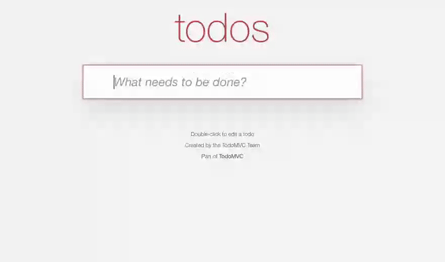
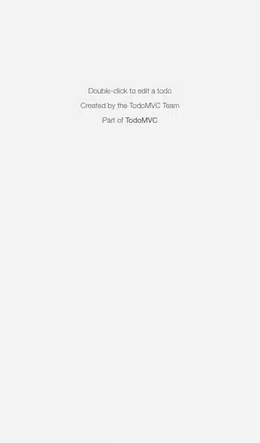

# screencast-axi

Record a scripted browser workflow as a watchable clip: a drawn cursor, burnt-in captions, and
mp4 + webm + a poster out the other end. Built to [AXI](https://github.com/kunchenguid/axi)
conventions, so an agent can drive it as comfortably as a person can.

<picture>
  <source srcset="docs/demo.anim.webp" type="image/webp">
  
</picture>

<sup>The ask, the scenario that came back, and the take it produced - itself recorded by this tool,
from [`demo/scenarios/demo.ts`](demo/scenarios/demo.ts). Re-record it with `pnpm demo`.</sup>

> **Status: 0.x and not yet published.** The recorder works end to end; the command surface is
> still growing. See [Roadmap](#roadmap).

## What the tool does

The clips below were produced by this repo - the scenarios are in
[`demo/scenarios/`](demo/scenarios/), and `pnpm demo:usecases` re-records them.

### Point it at any site and describe the workflow

There is no integration to write: no plugin for the site, no fixtures, no test IDs added to the
page. A scenario names what to do, and the recorder does it.

> _"Record a clip of searching Wikipedia for Ada Lovelace, opening the article, and jumping to the
> Work section. Around ten seconds."_

<picture>
  <source srcset="docs/usecase-anysite.anim.webp" type="image/webp">
  
</picture>

<sup>The whole scenario is [50 lines](demo/scenarios/anysite.ts), most of it narration and
comments.</sup>

### Records a sign-in, or skips past one

A login is an ordinary workflow as far as the recorder is concerned: a field, a field, a button.
It is worth filming, because it is the part of a product most demos skip.

<picture>
  <source srcset="docs/usecase-login.anim.webp" type="image/webp">
  
</picture>

For a real app you usually want the opposite - the clip should open already through the door
rather than spend its first seconds on a form. So signing in becomes a one-time human step:

```sh
screencast-axi auth login --interactive
```

> **A real Chrome window opens on your screen, at the site you are recording.**
> Sign in there however that site wants: password, SSO, a magic link, two-factor, a passkey.
> Then **close the window** - closing it is the signal that you are done.
> Nothing is ever typed into the terminal, and no credential passes through this package. The
> session is saved into a Chrome profile on your machine, and every later take reuses it.

An agent can open that window for you rather than making you retype the command, but it cannot
sign in for you and will not try: without `--interactive` it stops and says a person is needed,
and it refuses outright where no window could appear, such as a headless CI box. The wait is
bounded, so it can never hang.

For a login you can script, an `AuthStrategy` object in the config does the same job in typed
code ([worked example](demo/auth/form-login.ts)). Either way it runs before recording starts, so
none of it lands in the clip.

### Renders at phone and tablet viewports

```sh
screencast-axi record onboarding --device "iPhone 13" --orientation portrait
```

A device preset does more than set a width. Its `isMobile` and `hasTouch` flags decide whether the
site's own `@media (hover: none)` and touch rules apply at all, and it carries the right user
agent - so this is the mobile layout the site actually serves, not a desktop squeezed narrow.
Playwright ships 140+ presets; `--viewport 390x844` covers the rest.

<picture>
  <source srcset="docs/usecase-mobile.anim.webp" type="image/webp">
  
</picture>

<sup>The video is captured at the CSS viewport - 390x664 here - because Playwright composites the
page into the video canvas without scaling up. `deviceScaleFactor` still changes how the page
renders and which images it picks, but not the resolution of the recording.</sup>

### Shows you what it is doing

A scenario is arbitrary code driving a real browser, often one signed into your own account, so
"is this safe to run" deserves a better answer than "read the TypeScript".

```sh
screencast-axi rehearse <id> --headed
```

`--headed` runs it in a real window instead of hidden, so you can watch the whole thing. It does
not change the output - the clip is identical either way - so it costs nothing but the window.

Watching answers the question once, though, and only while you sit there. So a rehearsal also
prints what it did, in a form you can read before running, diff after an edit, and keep:

```
$ screencast-axi rehearse usecase-login

rehearsed: usecase-login
duration_s: 10.8
pace: 1
viewport: 900x540
steps[4]: A real login form,"Username, then password",Submitted for real,And the page behind it
hosts[1]: the-internet.herokuapp.com
performed[10]:
  - at_s: 0.2
    did: goto
    target: "https://the-internet.herokuapp.com/login"
  - at_s: 1.8
    did: waitFor
    target: #username
  - at_s: 1.8
    did: step
    detail: A real login form
  - at_s: 2.9
    did: step
    detail: "Username, then password"
  - at_s: 2.9
    did: type
    target: #username
    detail: tomsmith
  - at_s: 4.3
    did: type
    target: #password
    detail: •••••••• (20 chars)
  - at_s: 7.1
    did: step
    detail: Submitted for real
  - at_s: 7.1
    did: click
    target: "button[type=submit]"
  - at_s: 8.2
    did: waitFor
    target: h2
  - at_s: 8.8
    did: step
    detail: And the page behind it
```

Note the password: a field the log would otherwise leak records its shape and nothing else.

`hosts` is the short answer to where it went, taken from the pages the browser actually reached -
so a redirect or a navigation buried in `setup()` shows up too. A list of one host reads very
differently from a list of nine.

### Aims a clip at a length

```sh
screencast-axi record tour --duration 30s
```

One measuring pass, then it solves for the pace that lands near the target. A take is
`fixed + pace x scalable` - the site's own waits do not get slower because the recorder does - so
the solve uses the measured split rather than assuming everything scales. Pace is clamped to a
watchable range, and a target outside it is reported rather than obeyed.

### Emits what the destination needs

mp4 and webm every time, plus a poster frame. `--gif` and `--webp` add looping images for the
places a `<video>` does not render - a README, an npm page, an email. Every image on this page is
one of them. See [Output formats](#output-formats) for what each costs.

Drag-and-drop is handled too, including the HTML5 protocol that Chromium will not synthesise from
mouse events - the interaction most likely to look like a teleport if a recorder cuts corners.

## Why a script, not a screen recorder

A screencast is a performance with a script, not a recording of work being done. What makes one
watchable is a set of constants - a settle before each click, an eased pointer glide, a consistent
hold on each caption - and constants only help if you can run the same thing again and get the
same thing back. A scenario file survives a product change, gets reviewed in a pull request, and
can be re-cut at a different length without re-deciding anything.

## Quick start

No config needed. Point it at any site:

```sh
npx -y screencast-axi scaffold product-tour --url https://example.com
# fill in the run() body
npx -y screencast-axi rehearse ./scenarios/product-tour.ts
npx -y screencast-axi record   ./scenarios/product-tour.ts
```

`rehearse` runs the scenario without encoding, so a stale selector surfaces in seconds rather than
a minute - and the failure comes back with the URL it reached, a screenshot, and what each part of
the selector actually matched.

A scenario is TypeScript:

```ts
import { defineScenario } from "screencast-axi";

export default defineScenario({
  id: "product-tour",
  title: "A three-stop tour",
  description: "The pages that matter, in order.",
  steps: ["Where the work lives", "How it gets organised", "And what comes out"],

  async run(d) {
    await d.tour([
      { path: "/", step: 0, scroll: 0.6 },
      { path: "/features", step: 1, scroll: 0.5 },
      { path: "/pricing", step: 2 },
    ]);
  },
});
```

Each line in `steps` goes on screen once, in order. The same array becomes the burnt-in caption
and the manifest's step list, so the written workflow cannot drift from the recorded one - a take
that skips a line fails.

## Install

The skill is installed from GitHub; the CLI is pulled on demand, so there is nothing global:

```sh
npx skills add Valzon/screencast-axi --skill screencast-axi -g
```

## Prerequisites

| Piece       | Required | How it is found                                                      |
| ----------- | -------- | -------------------------------------------------------------------- |
| Node        | >= 20    |                                                                      |
| Chromium    | yes      | Playwright downloads it                                              |
| `ffmpeg`    | yes      | `$SCREENCAST_FFMPEG`, then an installed `ffmpeg-static`, then `PATH` |
| WebP poster | optional | ffmpeg's `libwebp`, else `cwebp`, else a PNG poster                  |

ffmpeg is not bundled: it is 80MB+ per platform, and _which_ build you have matters - many builds
(Homebrew's among them) ship without `libwebp`, which is why the poster has a fallback chain
rather than one hard requirement. If you would rather not install it system-wide,
`pnpm add -D ffmpeg-static` and the cascade finds it.

**Platforms:** macOS and Linux are tested, including in CI. Windows is intended to work but is
**unverified** - the known risks are argument quoting in spawned ffmpeg filter strings, path
separators inside those arguments, and Chrome's lock on a persistent profile directory.

## Recording a page behind a login

The strategy that needs no code for the site you are recording is `profileAuth()`. A person runs
this once:

```sh
npx -y screencast-axi auth login --interactive
```

A browser opens, they sign in however that site wants - OAuth, SSO, a magic link, two-factor - and
close the window. The session lives in a persistent Chrome profile and every take reuses it. No
credential is handled by this package.

`auth login` never reads stdin, so an agent can open the window on the user's screen rather than
making them retype a command. It cannot hang: the wait is bounded, and it refuses up front where
no window could appear.

Also shipped: `storageStateAuth({ path })` for a portable session file, and
`basicAuth({ username, password })` for staging environments. Anything else is an `AuthStrategy`
object written in the config - typed and debuggable rather than a shelled-out script.

> A scenario that creates or drags something **writes to whatever it is pointed at**. Prefer
> read-only scenarios against production, or point at staging.

## Seeing what a scenario does

A scenario is arbitrary code driving a real browser, often one signed into your own account, so
"what will this actually do" deserves a better answer than "read the TypeScript". Two:

```sh
screencast-axi rehearse <id>            # prints every action it took
screencast-axi rehearse <id> --headed   # and shows you it happening
```

A rehearsal prints `performed` - every goto, click, typed value, drag and scroll, in order, with
timings - and `hosts`, the short answer to where the script went. `--headed` opens a real window
and does not change the output; the clip is identical either way.

## Output formats

Every take produces an mp4, a webm and a poster. Looping images are opt-in with `--gif` and
`--webp`, for the places a `<video>` does not render - a README, an npm page, an email.

Measured on a real 16.7s app screencast, all at 800px and 15fps:

| Format        | Size     | vs mp4 |
| ------------- | -------- | ------ |
| mp4 (h264)    | 182 KB   | 1x     |
| animated WebP | 944 KB   | 5.2x   |
| GIF           | 2,034 KB | 11.2x  |

Prefer WebP where it renders: same content, roughly half the bytes, full colour rather than a
256-entry palette. Quality is not the deciding factor for flat app UI - 192 colours plus dithering
keeps small text legible - but a GIF has no controls, no seeking, no poster frame, cannot be
paused, and ignores `prefers-reduced-motion`. It is an export, not a storage format.

## Configuration

Optional. `screencast.config.ts` at the repo root, found by walking up from the working directory:

```ts
import { defineConfig, profileAuth } from "screencast-axi";

export default defineConfig({
  baseUrl: "http://localhost:3000",
  scenarios: ["scenarios/*.ts"],
  outDir: "public/demos",
  viewport: { width: 1440, height: 900 },

  browser: { profileDir: ".screencast/profile" },
  auth: profileAuth({ signedInSelector: "[data-testid=user-menu]" }),

  overlay: {
    accent: "#4f46e5",
    // Page chrome that should not end up in the footage.
    hideSelectors: ["#cookie-banner", "nextjs-portal"],
  },
});
```

Relative paths resolve against the config file, never the shell's working directory, so a command
means the same thing from anywhere in a repo.

## Mobile, and aiming at a length

```sh
screencast-axi record tour --device "iPhone 13" --orientation portrait --duration 20s
```

Device presets come from Playwright's registry, so a phone clip is captured at its real device
pixels rather than its CSS viewport - the difference between readable UI text and a smear.

`--duration` runs one measuring pass, then solves for the pace that lands near the target. A take
is `fixed + pace x scalable`: the site's own waits do not get slower because the recorder does, so
the solve uses the measured split rather than assuming everything scales.

## Reading the manifest

Every take writes `manifest.json` beside the clips. A site can read it at build time without
pulling in Playwright or a browser:

```ts
import { readManifest, clipFilesFor } from "screencast-axi/manifest";
```

That entry point has no runtime dependencies at all.

## Roadmap

- `list`, `show`, `check`, `doctor`, `setup`, `init`
- Publishing to npm

## Contributing

```sh
pnpm install
pnpm build && pnpm test && pnpm typecheck && pnpm format
```

`skills/screencast-axi/SKILL.md` is generated from `src/skill.ts` - edit the generator, run
`pnpm build:skill`, and commit the result. CI fails if the two drift, and the generator throws if
the stub grows past its character cap.

## License

MIT
